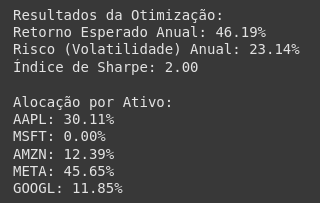
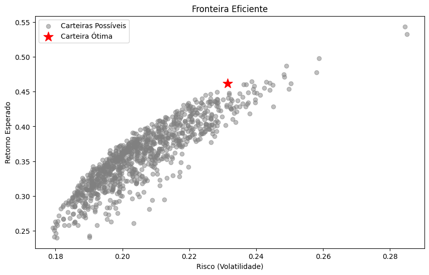
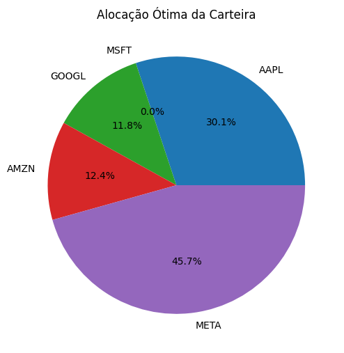
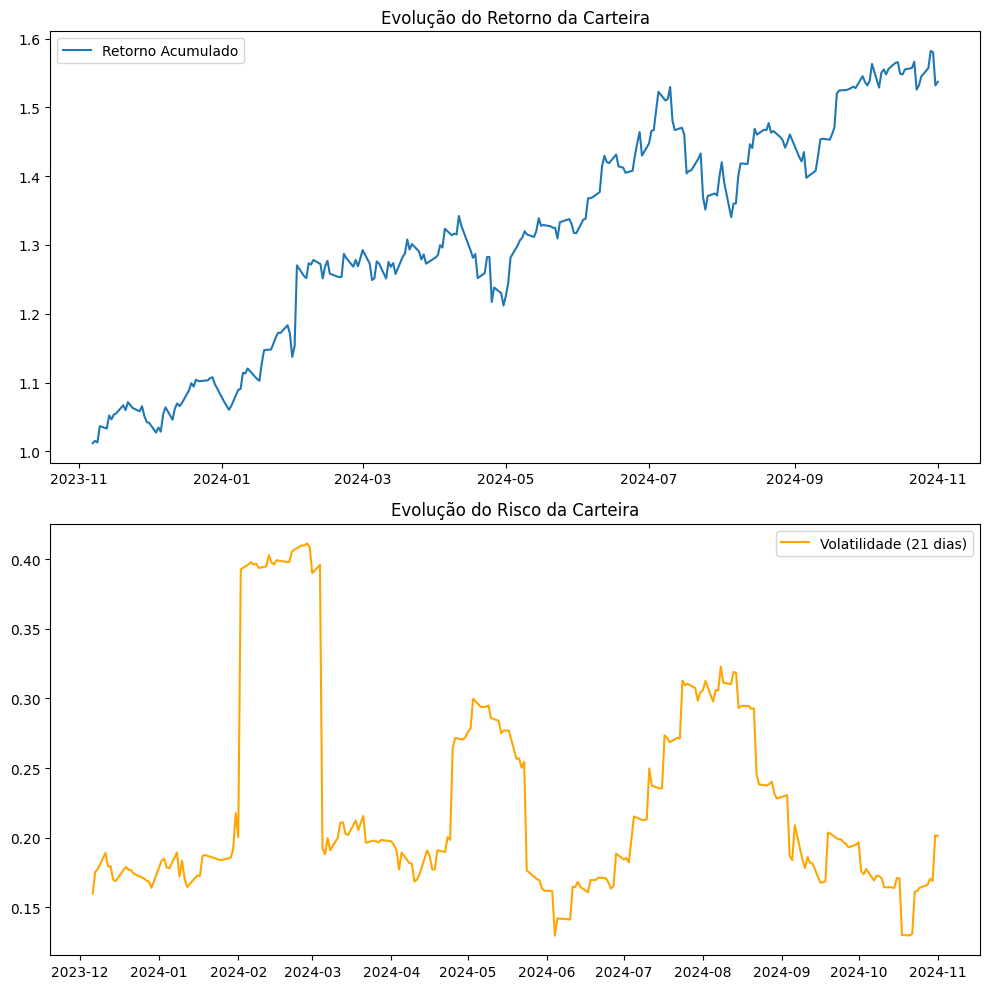

# APS de Otimização de Sistemas

- Disciplina: Otimização de Sistemas
- Nome: Sérgio Felippe de Souza Deiró
- Matricula: 2019101642
- Turma: 962

## Como executar?

- Acesse o [google colab](https://colab.research.google.com/)
- Cole o código do arquivo `aps_otimizacao_de_sistemas.py` na célula
- Informe o nome dos ativos de sua carteira na variável `tickets`, como por exemplo
```py
tickers = ['AAPL', 'MSFT', 'AMZN', 'META', 'GOOGL']
# OU
tickers = ['TSLA', 'NVDA', 'NFLX']
```
- Execute a celula com `ctrl+enter`


## Objetivo do trabalho

O código vai buscar dados sobre os ativos em um certo período de tempo, fará a otimização dos ativos, quais tiveram maiores retornos, e que o risco deve ser menor do que foi informado. Posteriormente será gerado gráficos de fronteira eficiente, de pizza para uma alocação mais eficiente de ativos e o de histórico de desempenho da carteira.

## Abordagem usada para a otimização

- A função objetivo é o `negative_sharpe_ratio`. O índice sharpe é o retorno ajustado ao risco.
- Método de otimização é o SLSQP (Sequential Least Squares Programming), que é bom em problemas de programação não linear com restrições.
- As restrições são:
    - Restrição de igualdade `{'type': 'eq'}`, garante que 100% do capital seja investido
    - Restrição de desigualdade `{'type': 'ineq'}`, o risco total deve ser menor que o limite
- As variáveis são 0 ou 1, já que deve ser escolhida um ativo.

## Funcoes principais
- `fetch_data`: busca os dados sobre os ativos em um intervalo de tempo, calcula a variação percentual do retorno dos ativos, a média dos retornos e a matriz de covariância da variação
- `optimize_portfolio`: otimizar usando a função minimize
```py
result = minimize(
    fun, # Função objetivo
    initial_weights, # Pesos
    method='SLSQP', # Método de otimização
    bounds=bounds, # Limites das variáveis
    constraints=constraints # Restrições
)
```
- `portfolio_performance`: calcula o retorno e o risco dos ativos
- `negative_sharpe_ratio`: calcula o índice sharpe e retorna o valor negativo para a função de minimização

## Gráficos

- `plot_efficient_frontier`: plota carteiras aleatórias de exemplo e plota a carteira otimizada.
- `plot_portfolio_allocation`: plota alocação ótima de carteira para ter maior retorno.
- `plot_performance_evolution`: plota o histórico do desempenho da carteira

## Exemplo de execução com resultados



### Fronteira eficiênte



### Alocação de ativos



### Hisstórico de desempenho da carteira

